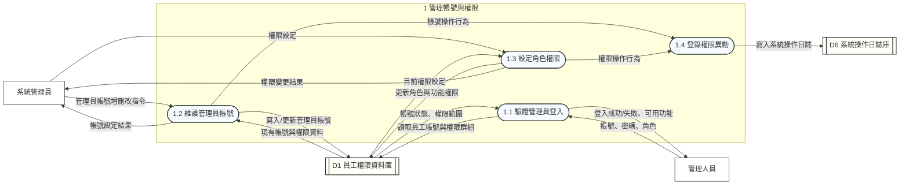
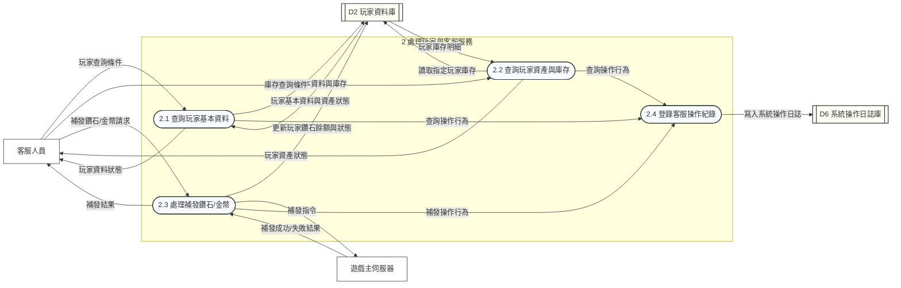
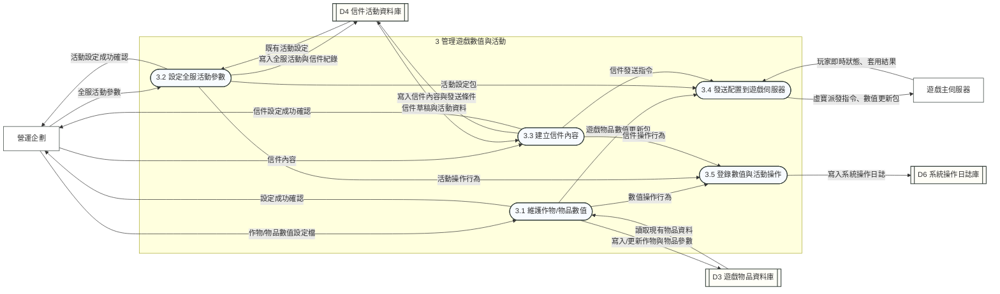
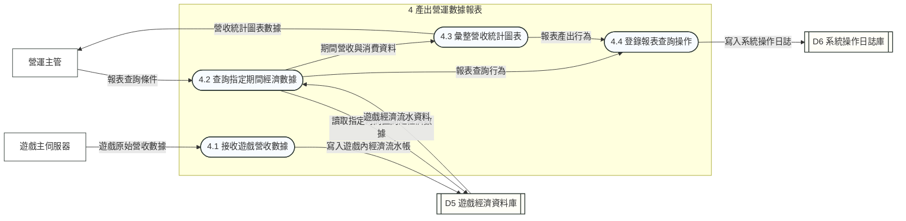
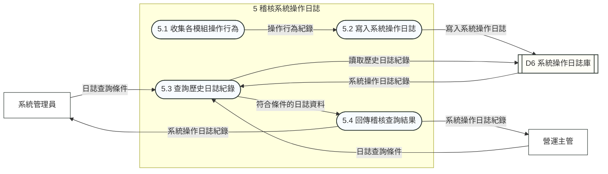

# LINE 熊大農場管理系統 Diagram 1-5

本文件依照 Diagram-0 的五個主要處理程序，展開 Diagram 1、2、3、4、5。資料儲存區代號沿用總圖：D1 員工權限資料庫、D2 玩家資料庫、D3 遊戲物品資料庫、D4 信件活動資料庫、D5 遊戲經濟資料庫、D6 系統操作日誌庫。

## Diagram 1：管理帳號與權限

## Diagram 2：處理玩家與客服服務

## Diagram 3：管理遊戲數值與活動

## Diagram 4：產出營運數據報表

## Diagram 5：稽核系統操作日誌

