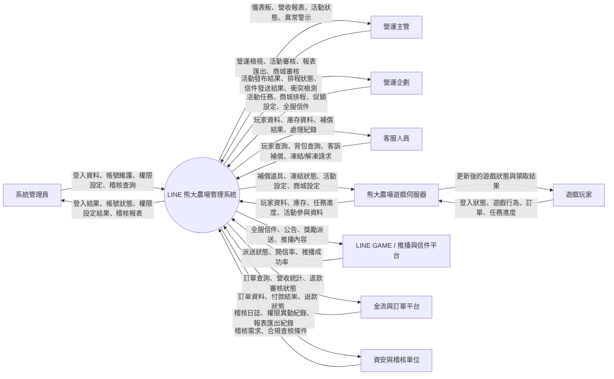
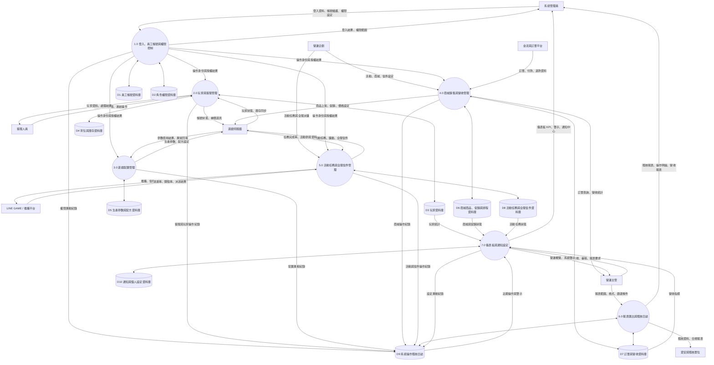
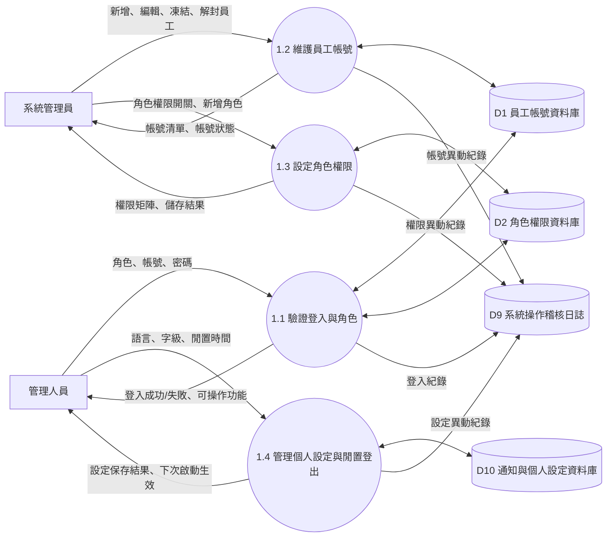
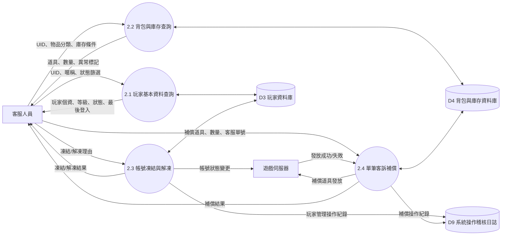
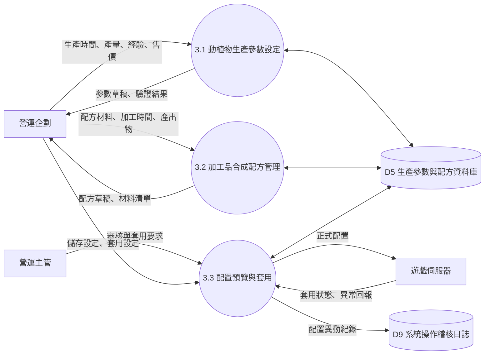
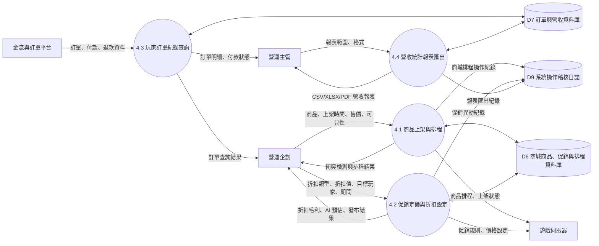
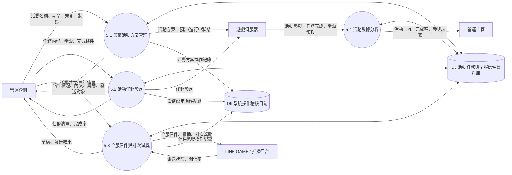
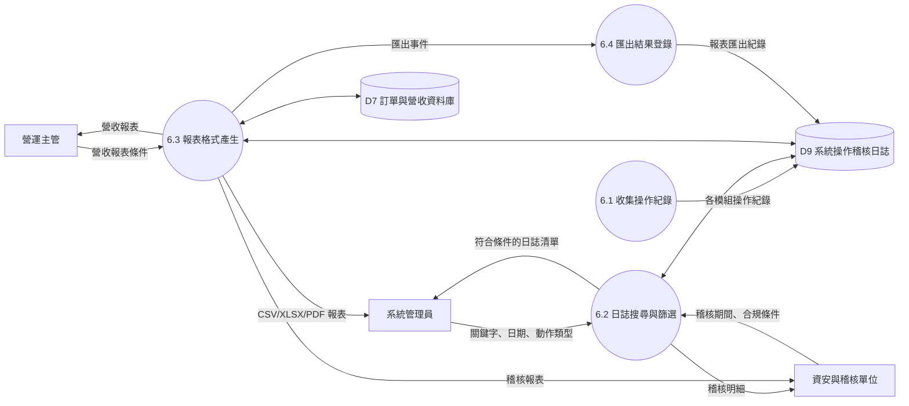

# LINE 熊大農場管理系統 DFD 文件

本文件整理「LINE 熊大農場管理系統」的資料流程圖，包含 Context Diagram、Diagram-0 與 Level-1 DFD。系統目前以前端展示版呈現，但下列 DFD 以正式後台營運系統的資料交換邏輯設計，可作為 SA/FDD、報告與後續後端 API 規劃依據。

## 圖例

| 符號 | 類型 | 說明 |
| --- | --- | --- |
| 方框 | External Entity | 系統外部角色或外部平台 |
| 圓角方框 | Process | 系統內部處理程序 |
| 雙線方框 | Data Store | 系統資料儲存區 |
| 箭頭 | Data Flow | 資料流向與交換內容 |

## Context Diagram

Context Diagram 將整個後台視為單一處理程序，重點是呈現外部實體與系統之間交換哪些資料。

### Context Diagram 資料流摘要

| 外部實體 | 輸入至系統 | 系統輸出 |
| --- | --- | --- |
| 系統管理員 | 登入資料、帳號管理、權限設定、稽核查詢條件 | 登入結果、帳號清單、權限設定結果、稽核報表 |
| 營運主管 | 儀表板檢視、活動/商城審核、報表匯出條件 | KPI、異常警示、營收報表、審核結果 |
| 營運企劃 | 活動任務、促銷規則、商品排程、全服信件 | 發布結果、排程清單、衝突偵測、派送狀態 |
| 客服人員 | 玩家 UID、客訴單、補償內容、凍結/解凍操作 | 玩家資料、庫存資料、補償結果、客服處理紀錄 |
| 遊戲伺服器 | 玩家資料、背包庫存、任務進度、活動參與紀錄 | 活動設定、商城設定、補償道具、帳號狀態 |
| LINE GAME / 推播平台 | 派送結果、開信率、推播成功率 | 全服信件、推播公告、批次獎勵 |
| 金流與訂單平台 | 訂單、付款、退款資料 | 訂單查詢、營收統計、退款審核 |
| 資安與稽核單位 | 稽核需求、合規查核條件 | 操作日誌、權限異動紀錄、報表匯出紀錄 |

## Diagram-0

Diagram-0 將整體系統拆成主要處理程序，並呈現資料儲存區之間的主要流向。

### Diagram-0 處理程序說明

| 編號 | 處理程序 | 主要目的 | 主要輸入 | 主要輸出 |
| --- | --- | --- | --- | --- |
| 1.0 | 登入、員工帳號與權限控制 | 管理後台登入、員工帳號、角色權限、閒置登出 | 登入資料、帳號資料、角色設定 | 登入結果、權限範圍、帳號狀態、權限異動日誌 |
| 2.0 | 玩家與客服管理 | 查詢玩家、背包、庫存，處理單筆補償與帳號凍結 | 玩家 UID、客服單、補償道具、凍結請求 | 玩家資料、庫存資料、補償結果、帳號狀態 |
| 3.0 | 遊戲配置管理 | 維護動植物生產參數與加工配方 | 生產時間、產量、成本、合成材料 | 遊戲參數、配方設定、套用結果 |
| 4.0 | 商城銷售與營收管理 | 管理商品上架、促銷折扣、訂單與營收報表 | 商品、價格、排程、促銷、訂單資料 | 上架結果、促銷狀態、訂單查詢、營收統計 |
| 5.0 | 活動任務與全服信件管理 | 管理節慶活動、任務、全服信件與批次派獎 | 活動資料、任務規則、信件內容、獎勵道具 | 活動發布、信件派送、獎勵派送、完成率 |
| 6.0 | 報表匯出與稽核日誌 | 查詢、篩選、匯出稽核與營收資料 | 日期範圍、動作類型、格式、搜尋條件 | CSV/XLSX/PDF 報表、稽核明細 |
| 7.0 | 儀表板與通知設定 | 顯示營運概況、通知中心、個人設定 | KPI 資料、通知資料、設定變更 | 儀表板、通知、語言/字級/閒置時間設定 |

## Level-1 DFD：1.0 登入、員工帳號與權限控制

## Level-1 DFD：2.0 玩家與客服管理

## Level-1 DFD：3.0 遊戲配置管理

## Level-1 DFD：4.0 商城銷售與營收管理

## Level-1 DFD：5.0 活動任務與全服信件管理

## Level-1 DFD：6.0 報表匯出與稽核日誌

## 主要資料儲存區

| 代號 | 資料儲存區 | 主要內容 |
| --- | --- | --- |
| D1 | 員工帳號資料庫 | 員工 ID、姓名、Email、角色、狀態、最後登入時間 |
| D2 | 角色權限資料庫 | 角色名稱、模組權限、操作權限、資料存取範圍 |
| D3 | 玩家資料庫 | UID、暱稱、等級、狀態、最後登入、客服標記 |
| D4 | 背包與庫存資料庫 | UID、物品 ID、物品名稱、分類、數量、異常標記 |
| D5 | 生產參數與配方資料庫 | 作物/動物生產時間、產量、加工材料、配方、成本 |
| D6 | 商城商品、促銷與排程資料庫 | 商品 ID、售價、折扣、目標族群、上架期間、狀態 |
| D7 | 訂單與營收資料庫 | 訂單 ID、UID、商品、金額、付款狀態、退款狀態 |
| D8 | 活動任務與全服信件資料庫 | 活動方案、任務條件、獎勵、信件草稿、派送紀錄 |
| D9 | 系統操作稽核日誌 | 日誌 ID、時間、操作人員、動作類型、執行內容、IP、結果 |
| D10 | 通知與個人設定資料庫 | 通知狀態、語言、字級、閒置登出時間、已讀狀態 |

## 主要資料流

| 資料流名稱 | 來源 | 目的地 | 內容 |
| --- | --- | --- | --- |
| 登入驗證資料 | 管理人員 | 1.1 驗證登入與角色 | 角色、帳號、密碼、記住我設定 |
| 權限範圍 | 1.0 權限控制 | 各功能模組 | 可讀取頁面、可操作按鈕、資料存取範圍 |
| 玩家查詢條件 | 客服人員 | 2.1 玩家基本資料查詢 | UID、暱稱、狀態、日期條件 |
| 玩家庫存資料 | D4 背包與庫存資料庫 | 2.2 背包與庫存查詢 | 物品 ID、分類、數量、異常狀態 |
| 補償派送資料 | 2.4 單筆客訴補償 | 遊戲伺服器 | UID、補償道具、數量、客服單號 |
| 生產配置資料 | 3.0 遊戲配置管理 | 遊戲伺服器 | 生產時間、產量、成本、解鎖等級 |
| 商品排程資料 | 4.1 商品上架與排程 | 遊戲伺服器 | 商品、售價、上架/下架時間、可見規則 |
| 促銷折扣規則 | 4.2 促銷定價與折扣設定 | 遊戲伺服器 | 折扣類型、折扣值、目標玩家、期間 |
| 訂單營收資料 | 金流與訂單平台 | 4.3 玩家訂單紀錄查詢 | 訂單 ID、付款金額、付款狀態、退款狀態 |
| 活動任務資料 | 5.2 活動任務設定 | 遊戲伺服器 | 任務 ID、完成條件、獎勵、期間 |
| 全服信件資料 | 5.3 全服信件與批次派獎 | LINE GAME / 推播平台 | 標題、內容、收件對象、獎勵附件 |
| 操作稽核紀錄 | 各功能模組 | D9 系統操作稽核日誌 | 操作人員、時間、動作、內容、結果 |
| 匯出報表資料 | 6.3 報表格式產生 | 管理人員/稽核單位 | CSV、XLSX、PDF 報表 |

## Balancing 檢查

Context Diagram 與 Diagram-0 的外部資料流需保持一致：

| Context Diagram 資料流 | Diagram-0 對應處理程序 |
| --- | --- |
| 管理人員登入、帳號維護、權限設定 | 1.0 登入、員工帳號與權限控制 |
| 玩家查詢、庫存查詢、補償、凍結/解凍 | 2.0 玩家與客服管理 |
| 生產參數、加工配方設定 | 3.0 遊戲配置管理 |
| 商城排程、促銷設定、訂單與營收 | 4.0 商城銷售與營收管理 |
| 活動任務、全服信件、批次派獎 | 5.0 活動任務與全服信件管理 |
| 稽核日誌查詢、報表匯出 | 6.0 報表匯出與稽核日誌 |
| 通知中心、個人設定、儀表板 | 7.0 儀表板與通知設定 |

## 備註

- 本 DFD 將前端展示版中的互動功能抽象為正式系統流程。
- 若後續串接後端，可依 Diagram-0 的處理程序拆分 API 模組。
- 系統操作稽核日誌 D9 是跨模組資料儲存區，所有新增、修改、刪除、匯出、派送、權限異動皆需寫入。
- 權限控制 1.0 應作為其他模組前置檢查，避免未授權角色執行敏感操作。
